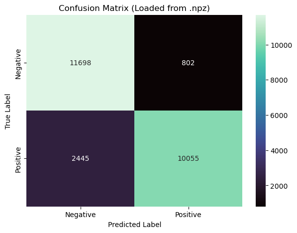

# IMDB Movie Sentiment Analyzer

A lightweight web application that predicts the sentiment (Positive/Negative) of movie reviews. This project features a **FastAPI** backend and a custom **NumPy-based inference engine**, removing the need for heavy machine learning libraries in the production environment.

## 📌 Project Overview

This application takes a movie review as input and outputs the probability of it being a positive review. It uses a neural network trained on the IMDB dataset.


## 📊 Dataset Details: IMDB Movie Reviews
The model was trained on the **Large Movie Review Dataset**, a benchmark for binary sentiment classification.

* **Total Samples**: 50,000 reviews (25,000 training / 25,000 testing).
* **Balance**: Perfectly balanced with 50% positive and 50% negative reviews.
* **Feature Engineering**: 
    * Limited to the **top 10,000** most frequent words.
    * **Multi-Hot Encoding**: Text is converted into a 10,000-dimensional binary vector where `1` represents the presence of a word and `0` its absence.


## 📈 Model Performance & Evaluation

The model was evaluated using a test subset of 200 samples. Below are the detailed metrics and the confusion matrix.

### Classification Report
| Class | Precision | Recall | F1-Score | Support |
| :--- | :--- | :--- | :--- | :--- |
| **0 (Negative)** | 0.89 | 0.69 | 0.78 | 163 |
| **1 (Positive)** | 0.32 | 0.62 | 0.42 | 37 |
| | | | | |
| **Accuracy** | | | **0.68** | 200 |
| **Macro Avg** | 0.60 | 0.66 | 0.60 | 200 |
| **Weighted Avg** | 0.78 | 0.68 | 0.71 | 200 |

### Confusion Matrix
The following matrix visualizes the performance of the model, showing the distribution of True Positives, True Negatives, False Positives, and False Negatives.




## 🧠 Model Architecture

The model is a Feed-Forward Neural Network with the following structure:
1.  **Input Layer:** Vectorized text (Bag-of-Words style, capped at 10,000 words).
2.  **Hidden Layers:** Two hidden layers with **ReLU** activation.
3.  **Output Layer:** Single unit with **Sigmoid** activation to output a probability between 0 and 1.

*Note: The actual training happens in `imdb_nn_model.ipynb`, while `app.py` performs the inference using the saved weights.*

## 📂 Repository Structure
```text
.
├── app.py                  # FastAPI Backend & Inference Engine
├── imdb_architecture.png   # Architecture Diagram
├── imdb_nn_model.ipynb     # Training Notebook
├── index.html              # Main Frontend UI
├── index3.html             # Alternative Frontend
├── model_params.npz        # Trained Weights (W1, b1, W2, b2, W3, b3)
├── requirements.txt        # Dependencies
├── results/
│   └── cm.png              # Confusion Matrix Plot
└── word_index.json         # Word-to-Index Vocabulary