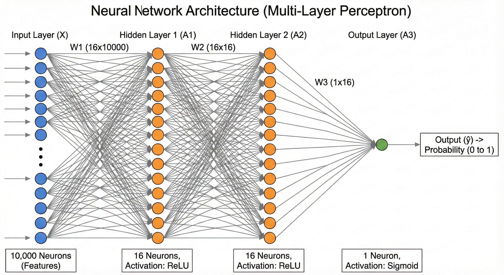

# IMDB Movie Sentiment Analyzer

A lightweight web application that predicts the sentiment (Positive/Negative) of movie reviews. This project features a **FastAPI** backend and a custom **NumPy-based inference engine**, removing the need for heavy machine learning libraries in the production environment.

## 📌 Project Overview

This application takes a movie review as input and outputs the probability of it being a positive review. It uses a neural network trained on the IMDB dataset.

## 📊 Dataset Details: IMDB Movie Reviews
The model was trained on the **Large Movie Review Dataset**, a benchmark for binary sentiment classification.

* **Total Samples**: 50,000 reviews (25,000 training / 25,000 testing).
* **Balance**: Perfectly balanced with 50% positive and 50% negative reviews.
* **Feature Engineering**: 
    * Limited to the **top 10,000** most frequent words.
    * **Multi-Hot Encoding**: Text is converted into a 10,000-dimensional binary vector where `1` represents the presence of a word and `0` its absence.
    
**Key Highlights:**
* **Full-Stack Implementation:** Includes a FastAPI backend and a responsive HTML/Bootstrap frontend.
* **Lightweight Inference:** The forward pass (prediction logic) is implemented purely in **NumPy**. The model weights (`W1`, `b1`, etc.) are loaded from a file, and the matrix multiplications and activation functions (ReLU, Sigmoid) are calculated manually.
* **Interactive UI:** Users can select sample reviews or type their own to see real-time predictions.

## 📂 Repository Structure

- `app.py`: The main FastAPI application. It handles model loading, the custom forward pass logic, and API endpoints.
- `index.html`: The frontend user interface built with Bootstrap 5. It communicates with the backend via the `/predict_sentiment/` endpoint.
- `model_params.npz`: Compressed NumPy file containing the trained weights and biases (W1, b1, W2, b2, W3, b3).
- `word_index.json`: A dictionary mapping words to their integer indices, used to vectorize input text.
- `imdb_nn_model.ipynb`: (Assumed) The Jupyter Notebook used to train the Neural Network and save the parameters.
- `requirements.txt`: List of Python dependencies.

## 🛠️ Technologies Used

- **Backend:** Python, FastAPI, Uvicorn
- **Computation:** NumPy (for vectorization and matrix operations)
- **Frontend:** HTML5, JavaScript (Fetch API), Bootstrap 5
- **Data Format:** JSON, NPZ

## 🧠 Model Architecture

The model is a Feed-Forward Neural Network with the following structure:
1.  **Input Layer:** Vectorized text (Bag-of-Words style, capped at 10,000 words).
2.  **Hidden Layers:** Two hidden layers with **ReLU** activation.
3.  **Output Layer:** Single unit with **Sigmoid** activation to output a probability between 0 and 1.

*Note: The actual training happens in `imdb_nn_model.ipynb`, while `app.py` performs the inference using the saved weights.*

## 🚀 How to Run

1.  **Clone the repository**
    ```bash
    git clone <your-repo-url>
    cd <repo-name>
    ```

2.  **Install Dependencies**
    ```bash
    pip install -r requirements.txt
    ```

3.  **Start the Application**
    ```bash
    python app.py
    ```

4.  **Access the App**
    Open your browser and navigate to:
    `http://localhost:8000`

## 📊 API Usage

You can also use the API programmatically:

**Endpoint:** `POST /predict_sentiment/`

**Request:**
```json
{
  "review": "The movie was absolutely fantastic! I loved the ending."
}
